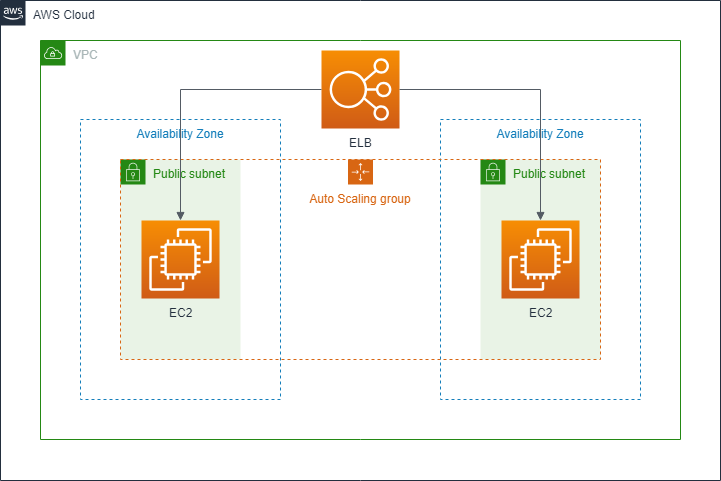
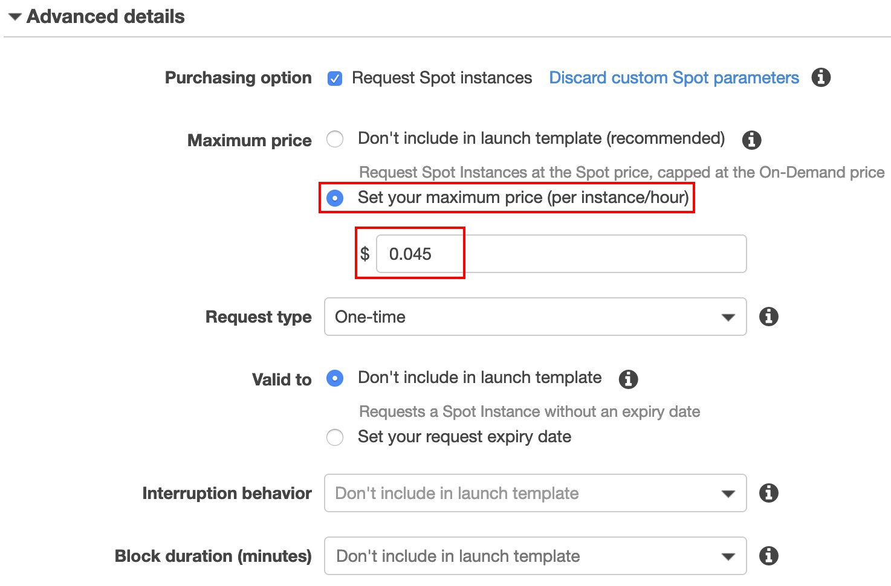

# Auto Scaling With Launch Template

## Scenario
The following procedures help you set up a scaled and load-balanced application, you will attach a load balancer to your Auto Scaling group. The load balancer automatically distributes incoming traffic across the instances in the group. And a CloudFront generates by Load balancer. This tutorial attaches a load balancer to an Auto Scaling group when you create the group, and set up a scaling policy to be triggered of target tracking scaling policy.

<p align="center">
    
</p>

## Prerequisites
> The workshop’s region will be in ‘N.Virginia’

> Prepare VPC, if there's no VPC's,you can use [lab-network](lab-network_yaml.yaml/) to deploy

## Lab tutorial
### Create Load Balancer and Target Group

[Elastic Load Balancing](https://aws.amazon.com/elasticloadbalancing/) automatically distributes incoming application traffic across multiple targets, such as EC2 instances, containers, IP addresses, and Lambda functions. It also can handle the varying load of your application traffic in a single Availability Zone or across multiple Availability Zones.
This part will walk you to create an Application Load Balancer to distributes incoming application traffic to EC2. 

1. On the **service** menu, click **EC2**.
    
2. In the navigation pane, click **Load Balancers**.
    
3. Click **Create Load Balancer**.
    
4. Choose **Application Load Balancer**, and click **Create**.

5. Specify the following settings:

    * Name: `WebServerLB`
    * Scheme: choose **internet-facing**
    * VPC: select **My Lab VPC**, choose Subnet with **name** **Lab Public Subnet 1** and **Lab Public Subnet 2** 

<p align="center">
    
</p>

6. Click **Next: Configure Security Settings**.

7. Click **Next: Configure Security Groups**.

8. Select **Select an existing security group**, choose `ALB SG`.

<p align="center">
    
</p>

9. Click **Next: Configure Routing**.

10. Enter the following information, and leave other as default:

    * Name: `WebServerTG`

11. Click **Next: Register Targets**.
    > Because there's no EC2 yet, we'll register it later.

12. Click **Next:Review**.

13. Click **Create**.

14. Click **Close**.

#### Create Launch Template
Launch templates enable you to store launch parameters so that you do not have to specify them every time you launch an instance.

1. On the left navigaiton pane, select **Launch Template**, and select **Create Launch Template**.

2.  * Choose **Create a new template**
    * **Launch template name**: `Auto-Scaling-Launch`
    * **Template version description**: `First Version`

<p align="center">
    
</p>

3.  * **AMI ID** choose **Amazon Linux AMI**.
    * **Instance type**: `t2.micro`
    * (Optional) **Key pair name**: Select a Key pair of your own or create one.
    * **Network type**: `VPC`
    * **Security Groups**: `Web SG`
    
<p align="center">
    
</p>

4. In Instance tags, type:
    * **Key**: `Name`
    * **Value**: `Your name`

<p align="center">
    
</p>

5. Expand the **Advanced details**, check **Request Spot Instances**, and select **Customize Spot parameters**.

<p align="center">
    
</p>

6. Select **Set your maximum price(per instance/hour)**, type $ ```0.0045```, and select ```One-time``` for **Request type**.

<p align="center">
    
</p>

7. Scroll down to the buttom of the page, copy and paste the command line below into the **User Data** which host a static web page:
```bash
#!/bin/bash
# Install Apache Web Server and PHP 
yum install -y php72 wget httpd24
# Download Lab files 
wget https://raw.githubusercontent.com/ecloudvalley/How-to-build-an-elastic-structure/master/index.php
mv index.php /var/www/html/
# Turn on web server 
chkconfig httpd on 
service httpd start
```

8. Select **Create Launch Template**.

9. After the **Success** page showed up, select **Create Auto Scaling group** in the middle of the page.

<p align="center">
    
</p>

#### Create Auto Scaling group

 [Auto Scaling](https://aws.amazon.com/autoscaling/?nc1=h_ls) monitors your applications and automatically adjusts capacity to maintain steady, predictable performance at the lowest possible cost. Using AWS Auto Scaling, it’s easy to setup application scaling for multiple resources across multiple services in minutes. Scaling Policy can be customized in several ways.

1. On the Create Auto Scaling Group, enter the following detail:

    * Group name: `Auto-Scaling-Group`
    * Group size: Start with `1` instance
    * Network: select **My Lab VPC**
    * Subnet: select both **Lab Public Subnet 1** and **Lab Public Subnet 2**

2. (**Option**) Launch Template allow you to combine different types of EC2 when you create an auto scaling group. You can select **Combine purchase options and instances** and discheck **Use the default settings to get started quickly** to deploy the instances you want.

<p align="center">
    
</p>

3. Scroll down and expand **Advanced Details**, and select **Receive traffic from one or more load balancers**.

4. Click in the **Target Groups** textbox and then click **WebServerTG**.

<p align="center">
    
</p>

5. Click **Next: Configure scaling policies**.

6. Click **Use scaling policies to adjust the capacity of this group**.

7. Modify the **Scale between** textbox to scale between **1** and **3** instances.

8. Specify the following settings:
    * Name: **Scale Group Size**
    * Metric type: **Average CPU Utilization**
    * Target value: **70**

<p align="center">
    
</p>

9. Click **Next: Configure Notifications**.

10. Click **Next: Configure Tags**, enter the following details:

    * Key: **Name**
    * Value: **AutoScaling Instance**

11. Click **Review**.

12. Review the details of your Auto Scaling group, then click **Create Auto Scaling group**.

13. Click **Close** when your Auto Scaling has been created.

### Test your website 

In the ALB Website, the web page will be changed since refresh the browser. There's no cache in ALB.
1. In the navigation pane, click **Load Balancer**.

2. Check the **Description** tag bellow, copy **DNS name** and paste it to the browser.

Now you can see the **Port**, **Public IP**,**Instance ID** and **Time** shown on the page.

3. Press **Refresh** to see the difference between the website.

## Clean up
Make sure to clean up the service we just created.

* Launch Template and Auto Scaling Group

    1. In the navigation pane, choose **Launch Template**.

    2. Right click on **Auto Scaling Launch** and choose **Delete template**.

    3. In the navigation pane, choose **Auto Scaling Groups**.

    4. Right click on **Auto-Scaling-Group** and choose **Delete**.

* Load Balancer and Target Group

    1. In the navigation pane, choose **Load Balancers**.

    2. Right click on **WebServerLB** and choose **Delete**.

    3. In the navigation pane, choose **Target Groups**.

    4. Right click on **WebServerTG** and choose **Delete**

## Conclusion
Congratulations! now you have learned:

* Create Load Balancer and Target Group
* Create Launch Template and Auto Scaling Group
* Trigger Auto Scaling Group with Target Tracking Scaling Policy

## Appendix
To test the Website and Elastic Load Balancer, you can try [Bees-with-Machine-Guns](Bees-with-Machine-Guns/)
